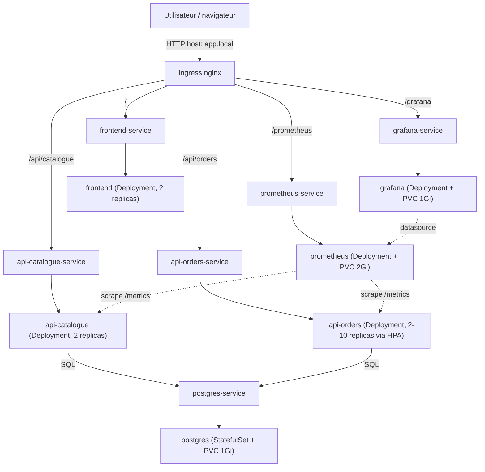

# Projet final - Clusteurisation de conteneurs

Application microservices déployée sur Kubernetes avec frontend, deux APIs, PostgreSQL, Ingress, HPA, Prometheus et Grafana.

## Architecture

- `frontend`: page statique servie par Nginx.
- `api-catalogue`: API Node.js exposant `/catalogue`, lit la table Postgres `catalogue`.
- `api-orders`: API Node.js exposant `/orders`, lit/écrit la table Postgres `orders`.
- `postgres`: base PostgreSQL gérée par `StatefulSet` + PVC.
- `prometheus` et `grafana`: supervision et visualisation (Prometheus scrape `api-catalogue` et
  `api-orders` via leurs annotations `prometheus.io/*` et leur endpoint `/metrics`).

Les ressources Kubernetes sont dans `k8s/` et sont déployées dans le namespace `projet-final`.
Tout le trafic entrant passe par un unique Ingress qui route par path vers le bon Service; seuls
les flux nécessaires sont autorisés entre pods (voir `k8s/security/networkpolicies.yaml`).



## Prérequis

- Un cluster Kubernetes accessible.
- `kubectl` configuré.
- Un Ingress controller compatible Nginx.
- `metrics-server` installé pour l'HPA.
- Les secrets GitHub configurés si la CI/CD est utilisée.

## Déploiement

### 1. Créer le namespace et les ressources de base

```bash
kubectl apply -f k8s/infra/namespace.yaml
kubectl apply -f k8s/infra/configmap.yaml
kubectl apply -f k8s/security/rbac.yaml
kubectl apply -f k8s/security/networkpolicies.yaml
kubectl apply -f k8s/data/postgres-init-configmap.yaml
kubectl apply -f k8s/data/postgres-statefulset.yaml
kubectl apply -f k8s/data/postgres-service.yaml
```

> Les Secrets (`app-secret`, `grafana-secret`) ne sont pas dans `k8s/` : ils sont créés par la CI
> à partir des secrets GitHub. Pour un déploiement manuel, créez-les avant l'étape suivante:
> `kubectl create secret generic app-secret -n projet-final --from-literal=DB_PASSWORD=<motdepasse>`
> `kubectl create secret generic grafana-secret -n projet-final --from-literal=admin-password=<motdepasse>`

### 2. Déployer les applications

```bash
kubectl apply -f k8s/apps/frontend-deployment.yaml
kubectl apply -f k8s/apps/frontend-service.yaml
kubectl apply -f k8s/apps/api-catalogue-deployment.yaml
kubectl apply -f k8s/apps/api-catalogue-service.yaml
kubectl apply -f k8s/apps/api-orders-deployment.yaml
kubectl apply -f k8s/apps/api-orders-service.yaml
kubectl apply -f k8s/apps/api-orders-hpa.yaml
kubectl apply -f k8s/apps/pdb.yaml
```

### 3. Déployer l'observabilité et l'exposition externe

```bash
kubectl apply -f k8s/monitoring/prometheus.yaml
kubectl apply -f k8s/monitoring/grafana.yaml
kubectl apply -f k8s/infra/ingress.yaml
```

## Validation rapide

```bash
kubectl get all -n projet-final
kubectl get ingress -n projet-final
kubectl get hpa -n projet-final
kubectl logs deploy/api-orders -n projet-final

# Sécurité et résilience ajoutées lors de la relecture
kubectl get sa,role,rolebinding -n projet-final
kubectl get networkpolicy -n projet-final
kubectl get pdb -n projet-final
kubectl get pvc -n projet-final
kubectl get ns projet-final --show-labels   # PodSecurity Admission (baseline enforce)
```

## Choix techniques

- `StatefulSet` pour PostgreSQL afin d'avoir un volume persistant.
- `RollingUpdate` pour limiter la coupure lors des mises à jour.
- `ClusterIP` pour garder les services internes non exposés directement.
- `Ingress` pour centraliser l'accès externe.
- `HPA` sur `api-orders` pour démontrer la scalabilité horizontale.
- `PodDisruptionBudget` (`minAvailable: 1`) sur les Deployments applicatifs pour survivre à un
  `kubectl drain`.
- ServiceAccounts dédiés + Role/RoleBinding namespacés (pas de `default` ni de ClusterRole) et
  `NetworkPolicy` default-deny en **ingress et egress** + règles explicites (y compris DNS) pour
  limiter les flux au strict nécessaire.
- PodSecurity Admission au niveau namespace : `enforce: baseline`, `warn`/`audit: restricted`.
  `baseline` seulement en enforce car le pod `postgres` (image officielle) démarre root pour
  chown son volume puis droppe ses privilèges en interne — `restricted` le rejetterait.
- Logs applicatifs structurés (JSON, un événement par requête HTTP) et métriques Prometheus
  personnalisées (`http_requests_total`, `http_request_duration_seconds`) sur les deux APIs, en
  plus des métriques runtime par défaut de `prom-client`.
- Dashboard Grafana ("API Overview - projet-final") provisionné as-code via ConfigMap plutôt que
  créé à la main dans l'UI : reproductible et survit à une PVC vide.
- Le scan d'image (Trivy) en CI bloque le déploiement sur les CVE `CRITICAL` (`exit-code: 1`) ;
  les CVE `HIGH` restent non bloquantes pour éviter les faux blocages sur des images de base
  qu'on ne maîtrise pas entièrement (node/nginx/postgres).
- Images taguées avec le sha du commit (pas seulement `:latest`) pour que `rollout undo` soit
  réellement démonstratif.

## Limites

- L'alerte automatique n'est pas encore formalisée avec Alertmanager (voir RUNBOOK pour la version
  conceptuelle).
- Les `NetworkPolicy` supposent qu'ingress-nginx tourne dans un namespace nommé `ingress-nginx` et
  que CoreDNS tourne dans `kube-system` (cas par défaut sur k3s et sur le manifest officiel utilisé
  dans le RUNBOOK) — à adapter si votre cluster diffère.
- Pas de TLS sur l'Ingress (HTTP uniquement) — hors périmètre pour la démo sur VPS.
- Aucun test unitaire ni lint sur le code applicatif ; seule l'image scanning (Trivy) satisfait
  l'exigence qualité de la CI.
- Les preuves de résilience et de scale doivent être montrées en démo avec les commandes du runbook.
